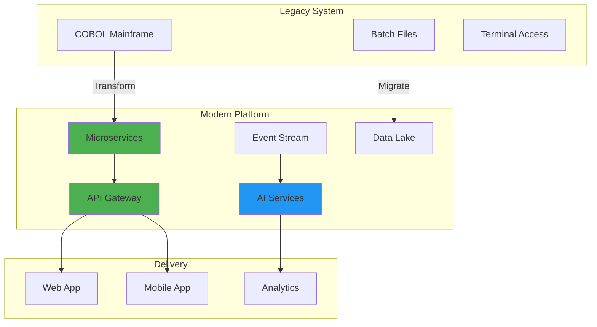

# Super Challenge - Enterprise AI Transformation

## 📚 Resources & Navigation

- [Quickstart](quickstart.md) — Start here for a fast setup
- [Prerequisites](prerequisites.md) — Environment and tools needed
- [Solution Guide](solution-guide.md) — Step-by-step solution hints
- [Business Rules Card](business-rules-card.md) — Key business logic
- [Cheatsheet](cheatsheet.md) — Quick reference for commands and concepts
- [Visual Guide](visual-guide.md) — Diagrams and flows
- [Resources Summary](resources-summary.md) — All resources at a glance
- [Additional Resources](additional-resources.md) — Extra learning material
- [Troubleshooting](troubleshooting.md) — Fix common issues
- [Demo Presentation Script](demo-presentation-script.md) — For your final demo
- [Error Recovery](error-recovery.md) — Handle and recover from errors
- [Complete Package](complete-package.md) — All-in-one reference
- [K8s Manifests](k8s-manifests.txt) — Kubernetes deployment
- [Terraform for Azure](terraform-azure.txt) — Infrastructure as code
- [Integration Tests (Python)](integration-tests.py) — Automated integration tests
- [Performance Test (Python)](performance-test.py) — Performance validation
- [Validation Script (Python)](validation-script.py) — Final checks
- [Start Script (Shell)](start-script.sh) — Launch your environment

### 🔗 Quick Navigation
- Next: [Read the Quickstart](quickstart.md)

---

## ➡️ Next Steps

1. [Read the Quickstart](quickstart.md)
2. [Check Prerequisites](prerequisites.md)
3. [Review the Solution Guide](solution-guide.md)
4. [Understand Business Rules](business-rules-card.md)
5. [Use the Cheatsheet](cheatsheet.md) as you code
6. [Visual Guide](visual-guide.md) for architecture
7. [Resources Summary](resources-summary.md) and [Additional Resources](additional-resources.md)
8. [Troubleshooting](troubleshooting.md) if you get stuck
9. [Demo Presentation Script](demo-presentation-script.md) for your final pitch
10. [Error Recovery](error-recovery.md) and [Complete Package](complete-package.md) for advanced help
11. [K8s Manifests](k8s-manifests.txt) and [Terraform for Azure](terraform-azure.txt) for deployment
12. [Integration Tests](integration-tests.py), [Performance Test](performance-test.py), [Validation Script](validation-script.py) for validation
13. [Start Script](start-script.sh) to launch your environment

---

## 🏆 Challenge Overview

Welcome to the ultimate test of your AI-powered development skills! This comprehensive 3-hour challenge simulates a real-world enterprise transformation project. 

### Duration
- **Total Time**: 4 hours (strict time limit)
- **Planning Phase**: 30 minutes
- **Implementation Phase**: 3 hours
- **Deployment & Demo**: 30 minutes

## 🎯 Challenge Objectives

Your mission is to transform **GlobalRetail Corp's** legacy systems into a modern, AI-powered platform:

1. **Modernize legacy COBOL inventory system**
2. **Build microservices architecture** with AI capabilities
3. **Implement real-time analytics** and predictions
4. **Deploy to Azure** with full CI/CD
5. **Ensure security and compliance**

## 📋 The Scenario

### Background

GlobalRetail Corp operates 5,000 stores worldwide with:
- 50-year-old COBOL mainframe system
- 100M+ daily transactions
- 500TB of historical data
- 24/7 operations requirement
- $10B annual revenue at risk

### Current Pain Points
- 6-hour batch processing delays
- No real-time inventory visibility
- Manual fraud detection
- $50M annual losses from stockouts
- 3-month lead time for new features

### Success Criteria
- Real-time transaction processing
- AI-powered demand forecasting
- Automated fraud detection
- 99.99% uptime
- 10x faster feature delivery

## 🏗️ Technical Requirements

### Architecture Requirements



### Functional Requirements

1. **Inventory Management**
   - Real-time stock levels
   - Multi-location tracking
   - Automated reordering

2. **Sales Processing**
   - < 100ms transaction time
   - Offline capability
   - Multi-currency support

3. **AI Capabilities**
   - Demand forecasting
   - Price optimization
   - Fraud detection
   - Customer recommendations

4. **Analytics**
   - Real-time dashboards
   - Predictive analytics
   - Custom reports

5. **Integration**
   - Legacy system bridge
   - Third-party APIs
   - Mobile SDKs

### Non-Functional Requirements

- **Performance**: 100K TPS
- **Availability**: 99.99% uptime
- **Security**: PCI-DSS compliant
- **Scalability**: Auto-scale 10x
- **Recovery**: RTO < 5 min, RPO < 1 min

## 🎯 Challenge Tasks

### Phase 1: Planning & Architecture (30 minutes)

#### Task 1.1: System Analysis
Using GitHub Copilot, analyze the provided COBOL code and:
- Document business logic
- Identify modernization candidates
- Create data flow diagrams
- Define microservice boundaries

#### Task 1.2: Architecture Design
Design the target architecture including:
- Microservices decomposition
- Data storage strategy
- AI integration points
- Security architecture
- Infrastructure design

#### Task 1.3: Migration Strategy
Create a migration plan that ensures:
- Zero downtime migration
- Data integrity
- Rollback capability
- Phased approach

### Phase 2: Implementation (3 hours)

#### Task 2.1: Core Services Development

```python
# Prompt: Create inventory microservice with:
# - Real-time stock tracking
# - Event-driven updates
# - AI-powered forecasting
# - CQRS pattern
# - Full test coverage

# You'll implement:
# 1. Inventory Service (Python/FastAPI)
# 2. Sales Service (.NET/ASP.NET Core)
# 3. Analytics Service (Python/ML)
# 4. Integration Service (Node.js)
```

#### Task 2.2: AI Implementation

```python
# Implement three AI models:
# 1. Demand Forecasting
#    - Use historical sales data
#    - Consider seasonality
#    - Real-time adjustments

# 2. Fraud Detection
#    - Transaction pattern analysis
#    - Real-time scoring
#    - Automatic blocking

# 3. Price Optimization
#    - Dynamic pricing
#    - Competitor analysis
#    - Margin protection
```

#### Task 2.3: Data Migration

```python
# Create data pipeline that:
# 1. Extracts from COBOL files
# 2. Transforms to modern format
# 3. Loads to cloud storage
# 4. Validates integrity
# 5. Maintains audit trail
```

#### Task 2.4: Infrastructure as Code

```hcl
# Deploy complete infrastructure:
# - AKS cluster with auto-scaling
# - Cosmos DB with global distribution
# - Service Bus for messaging
# - API Management gateway
# - Monitoring and alerting
```

### Phase 3: Deployment & Demo (30 minutes)

#### Task 3.1: CI/CD Pipeline
- GitHub Actions workflow
- Automated testing
- Security scanning
- Progressive deployment

#### Task 3.2: Monitoring Setup
- Application Insights
- Custom dashboards
- Alert configuration
- SLA tracking

#### Task 3.3: Live Demo
- Deploy to production
- Demonstrate all features
- Show performance metrics
- Prove scalability

## 📊 Evaluation Criteria

### Technical Implementation (40%)
- Code quality and organization
- Proper use of GitHub Copilot
- Design patterns implementation
- Error handling and resilience

### Architecture & Design (20%)
- Scalability considerations
- Security implementation
- Cost optimization
- Future extensibility

### AI Integration (20%)
- Model effectiveness
- Real-time processing
- Business value delivery
- Innovation in approach

### Deployment & Operations (20%)
- Complete automation
- Monitoring coverage
- Documentation quality
- Demo effectiveness

## 🏁 Getting Started

### Quick Start Commands

```bash
# Clone challenge repository
git clone https://github.com/paulasilvatech/Mastery-AI-Code-Development
cd module-22-challenge

# Set up environment
./scripts/setup-challenge.sh

# Start timer (3 hours begins now!)
./scripts/start-timer.sh

# Access resources
cd resources/
# - legacy-code/: COBOL programs
# - sample-data/: Test datasets
# - templates/: Starter templates
```

### Available Resources

1. **Legacy Code Samples**
   - INVPROC.CBL (Inventory Processing)
   - SALESCALC.CBL (Sales Calculations)
   - RPTGEN.CBL (Report Generation)

2. **Test Data**
   - 1M transaction records
   - 5 years historical data
   - Product catalog

3. **Starter Templates**
   - Microservice scaffolding
   - IaC templates
   - CI/CD workflows

4. **AI Model Starters**
   - Pre-trained base models
   - Feature engineering scripts
   - Evaluation notebooks

## 💡 Tips for Success

### Time Management
- **0:00-0:30**: Planning (Don't skip!)
- **0:30-1:30**: Core implementation
- **1:30-2:00**: AI integration
- **2:00-2:30**: Infrastructure & deployment
- **2:30-3:00**: Testing & demo prep

### GitHub Copilot Strategies
1. **Start with architecture comments**
   ```python
   # Architecture: Event-driven microservices with CQRS
   # Service: Inventory management with real-time updates
   # Patterns: Repository, Unit of Work, Domain Events
   # Dependencies: FastAPI, SQLAlchemy, Redis, Kafka
   ```

2. **Use specific prompts**
   ```python
   # Create a demand forecasting model that:
   # - Uses Prophet for time series
   # - Considers promotions and holidays
   # - Updates predictions hourly
   # - Integrates with inventory service
   ```

3. **Leverage multi-file context**
   - Open related files for better suggestions
   - Reference existing patterns
   - Use consistent naming

### Common Pitfalls to Avoid
- ❌ Over-engineering the solution
- ❌ Ignoring legacy business logic
- ❌ Skipping tests
- ❌ Manual deployment steps
- ❌ Forgetting monitoring

## 🏆 Success Metrics

### Minimum Viable Solution
- [ ] 3 working microservices
- [ ] 1 AI model integrated
- [ ] Basic CI/CD pipeline
- [ ] Deployed to Azure
- [ ] Passing integration tests

### Good Solution
All of the above plus:
- [ ] All 5 microservices
- [ ] 2 AI models working
- [ ] Complete monitoring
- [ ] Performance testing
- [ ] Security scanning

### Excellent Solution
All of the above plus:
- [ ] All 3 AI models integrated
- [ ] Multi-region deployment
- [ ] Chaos engineering tests
- [ ] Cost optimization
- [ ] Innovation bonus

## 📝 Final Checklist

Before starting, ensure you have:
- [ ] Set up all prerequisites
- [ ] 3 hours uninterrupted time
- [ ] Backup internet connection
- [ ] Coffee/energy drinks ready

## 🎯 Ready? Set? Code!

Remember:
- **Trust your training**
- **Use AI effectively**
- **Focus on business value**
- **Have fun!**

---

**"This challenge separates good developers from AI-powered superheroes. Show us what you've got!"**

[**START CHALLENGE**](./scripts/start-challenge.sh)

---

**Good luck! May your code compile and your tests pass! 🚀🏆**
