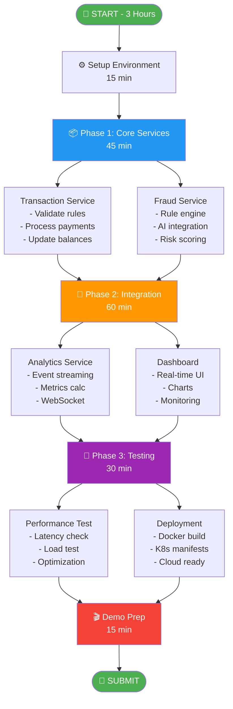
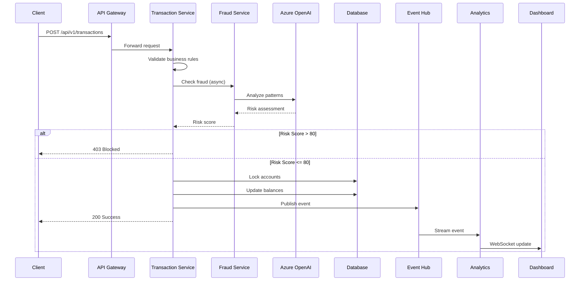
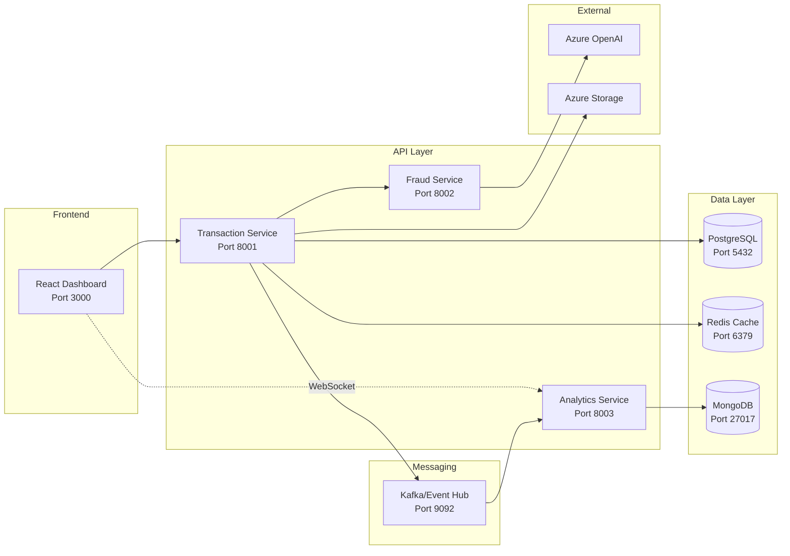
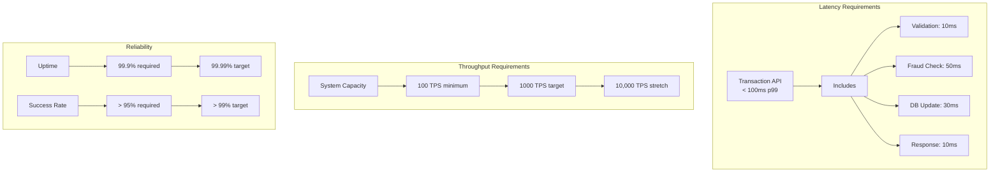
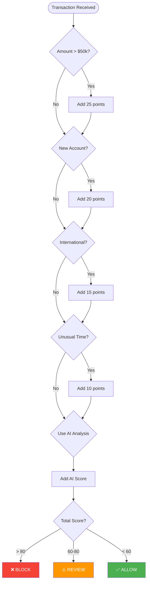
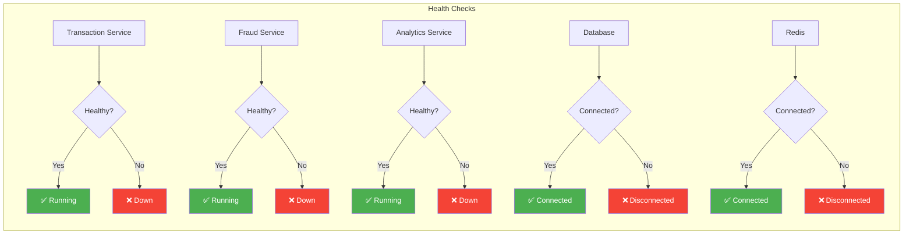
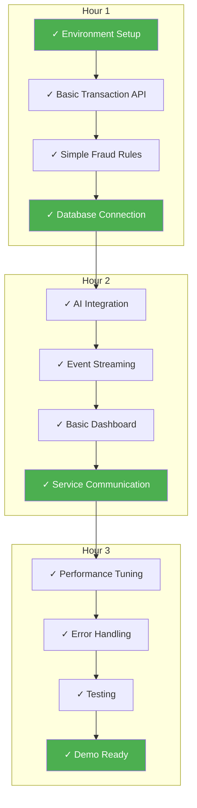

# 📊 Module 22: Visual Process Guide

## 🗺️ Challenge Roadmap



## 🔄 Transaction Flow Diagram



## 🏗️ Architecture Components



## 📈 Performance Requirements Visual



## 🎯 Decision Flow for Fraud Detection



## 🚦 Service Health Status Board



## 📊 Dashboard Layout Template

```
┌─────────────────────────────────────────────────────────────┐
│                    Transaction Dashboard                      │
├─────────────────┬─────────────────┬─────────────────────────┤
│ Total Volume    │ Fraud Blocked   │ Avg Response Time       │
│ $1,234,567     │ 42 ($89,123)    │ 45ms                    │
├─────────────────┴─────────────────┴─────────────────────────┤
│                                                              │
│  Transaction Volume (Last Hour)                              │
│  ┌────────────────────────────────────────────────────┐     │
│  │     ___                                             │     │
│  │    /   \___/\___                                   │     │
│  │___/            \___/\___/\___/\_____               │     │
│  └────────────────────────────────────────────────────┘     │
│                                                              │
├──────────────────────────┬───────────────────────────────────┤
│ Risk Distribution        │ Transaction Types                 │
│ ┌──────────────────┐     │ ┌─────────────────────────┐     │
│ │ Low    ████ 75%  │     │ │ Domestic  ████████ 80% │     │
│ │ Medium ██   20%  │     │ │ Int'l     ██      15%  │     │
│ │ High   █    5%   │     │ │ Wire      █       5%   │     │
│ └──────────────────┘     │ └─────────────────────────┘     │
├──────────────────────────┴───────────────────────────────────┤
│ System Status: All Services Operational ✅                   │
└──────────────────────────────────────────────────────────────┘
```

## 🔑 Key Implementation Checkpoints



## 🎯 Success Criteria Checklist

```
API Requirements
├─ ✅ POST /api/v1/transactions
├─ ✅ GET /api/v1/transactions/{id}
├─ ✅ GET /api/v1/accounts/{id}
└─ ✅ GET /health (all services)

Business Rules
├─ ✅ Min/Max amount validation
├─ ✅ Account format validation
├─ ✅ Different account check
├─ ✅ Balance verification
├─ ✅ Fee calculation
└─ ✅ VIP no-fee logic

Fraud Detection
├─ ✅ Rule-based checks
├─ ✅ AI integration
├─ ✅ Risk scoring
└─ ✅ Block high-risk

Performance
├─ ✅ < 100ms latency (p99)
├─ ✅ 100+ TPS capability
├─ ✅ Connection pooling
└─ ✅ Caching implemented

Deployment
├─ ✅ Docker images built
├─ ✅ Kubernetes manifests
├─ ✅ Health checks work
└─ ✅ README complete
```

---

**Visual guides help you stay on track! Print this out or keep it open during the challenge! 🎯**