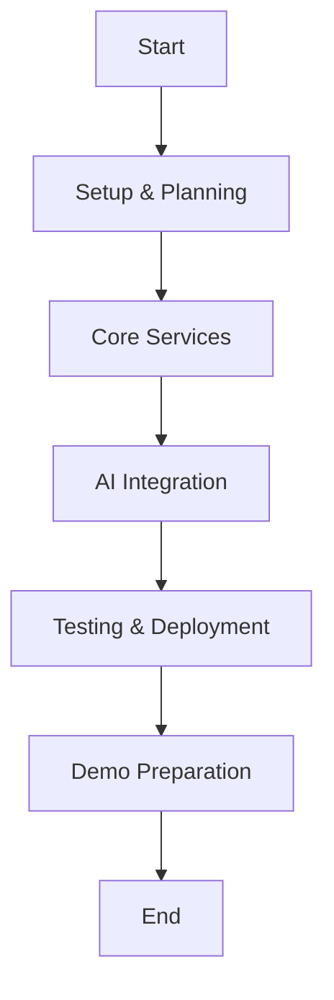

# 🚀 Quick Start Guide — Super Challenge


---

## 📚 Resources & Navigation

- [Overview](README.md)
- [Prerequisites](prerequisites.md)
- [Solution Guide](solution-guide.md)
- [Business Rules Card](business-rules-card.md)
- [Cheatsheet](cheatsheet.md)
- [Visual Guide](visual-guide.md)
- [Troubleshooting](troubleshooting.md)

---


## ⏱️ Time Management Strategy


You have **4 hours** to complete the challenge. Here's the optimal time allocation:

| Time         | Task                        |
|--------------|-----------------------------|
| 00:00-00:15  | Setup & Planning            |
| 00:15-01:15  | Core Services Implementation|
| 01:15-02:15  | AI Integration & Analytics  |
| 02:15-02:45  | Testing & Deployment        |
| 02:45-03:00  | Demo Preparation            |


---

## 🎯 Minimum Viable Solution


| Must Have (80% of score)         | Nice to Have (20% bonus)           |
|----------------------------------|------------------------------------|
| ✅ Transaction API w/ business rules | ⭐ Advanced AI features (multi-agent, learning) |
| ✅ Basic fraud detection with AI  | ⭐ Full event streaming implementation |
| ✅ Data persistence (PostgreSQL + Redis) | ⭐ Complete cloud deployment |
| ✅ Simple real-time dashboard     | ⭐ Comprehensive test coverage      |
| ✅ One deployment method         | ⭐ Performance optimizations        |


---

## 🛠️ Quick Setup Commands


### 1. Initial Setup (5 minutes)
```bash
# Clone and setup
git clone https://github.com/workshop/module-22-super-challenge.git
cd module-22-super-challenge

# Run automated setup
./scripts/setup-challenge-env.sh
```

---

## 🗺️ Architecture Flow



---

## ➡️ Next Steps

1. [Check Prerequisites](prerequisites.md)
2. [Review the Solution Guide](solution-guide.md)
3. [Understand Business Rules](business-rules-card.md)
4. [Use the Cheatsheet](cheatsheet.md) as you code
5. [Visual Guide](visual-guide.md) for architecture
6. [Troubleshooting](troubleshooting.md) if you get stuck

---
# Copy and configure environment
cp .env.example .env
# Edit .env with your Azure credentials

# Start local services
docker-compose up -d

# Activate Python environment
source venv/bin/activate  # or venv\Scripts\activate on Windows
pip install -r requirements.txt

# Verify everything is running
./scripts/test-services.sh
```

### 2. Start the Timer
```bash
# This starts your 3-hour countdown
./scripts/start-challenge.sh
```

## 📝 Essential GitHub Copilot Prompts

Use these prompts to accelerate development:

### For Transaction Service
```python
# "Implement transaction validation following COBOL business rules:
#  - Min amount: $0.01, Max: $1,000,000
#  - Daily limit: $5,000,000
#  - VIP customers have no fees
#  - Business accounts can overdraft up to $100,000"

# "Create async function to process transaction atomically with:
#  - Account locking
#  - Balance validation
#  - Fee calculation
#  - Event publishing"

# "Generate comprehensive error handling for all transaction edge cases"
```

### For Fraud Detection
```python
# "Implement multi-layer fraud detection with:
#  - Velocity check: max 50 transactions/hour
#  - Amount anomaly: flag if 300% above average
#  - Geographic check: multiple countries = high risk
#  - Time pattern: 2-5 AM adds risk points"

# "Create Azure OpenAI integration for intelligent fraud analysis using GPT-4"

# "Build self-learning fraud detection that improves from confirmed cases"
```

### For Analytics
```python
# "Create WebSocket endpoint that broadcasts real-time metrics including:
#  - Transaction count and volume
#  - Fraud detection statistics  
#  - Response time percentiles
#  - Geographic distribution"

# "Implement Event Hub consumer for transaction event processing"
```

### For Testing
```python
# "Generate comprehensive integration tests for transaction flow"
# "Create performance test to verify < 100ms p99 latency"
# "Build security tests for SQL injection and authentication"
```

## 🔥 Speed Development Tips

### 1. Use Provided Starters
Don't write from scratch! The starter code has TODOs:
```python
# src/transaction-service/main.py
@app.post("/api/v1/transactions")
async def process_transaction(transaction: TransactionRequest):
    # TODO: Your implementation here
    # Hint: Use GitHub Copilot to help implement each step
    # Start by typing: "# Step 1: Validate transaction"
```

### 2. Copy Business Logic from COBOL
The COBOL file contains all business rules:
```
legacy-code/TRANSACTION-PROCESSOR.cob
- Lines 50-70: Validation rules
- Lines 100-150: Fee calculations
- Lines 200-250: Fraud checks
```

### 3. Use Docker Compose Services
Everything is pre-configured:
- PostgreSQL: `localhost:5432`
- Redis: `localhost:6379`
- MongoDB: `localhost:27017`
- Kafka: `localhost:9092`

### 4. Leverage AI Heavily
Let GitHub Copilot write:
- Validation functions
- Database queries
- Test cases
- Error handling
- API documentation
- Deployment configs

## 📋 Implementation Checklist

### Phase 1: Core Services (First Hour)
- [ ] Transaction Service
  - [ ] API endpoints working
  - [ ] Business rules implemented
  - [ ] Database integration
  - [ ] Basic error handling
- [ ] Fraud Service  
  - [ ] Rule-based checks
  - [ ] Azure OpenAI connected
  - [ ] Risk scoring working
- [ ] Basic Integration
  - [ ] Services can communicate
  - [ ] Data persists correctly

### Phase 2: AI & Analytics (Second Hour)
- [ ] Enhanced Fraud Detection
  - [ ] Multi-layer analysis
  - [ ] AI recommendations
  - [ ] Pattern learning
- [ ] Real-time Analytics
  - [ ] Event processing
  - [ ] Metrics aggregation
  - [ ] WebSocket broadcasting
- [ ] Dashboard
  - [ ] Live data display
  - [ ] Charts working
  - [ ] Mobile responsive

### Phase 3: Polish & Deploy (Final 45 min)
- [ ] Testing
  - [ ] Integration tests pass
  - [ ] Performance validated
  - [ ] Security checked
- [ ] Deployment
  - [ ] Docker images built
  - [ ] Kubernetes manifests ready
  - [ ] Services accessible
- [ ] Documentation
  - [ ] README updated
  - [ ] API documented
  - [ ] Demo script ready

## 🚨 Common Pitfalls & Solutions

### Problem: Services won't start
```bash
# Quick fix
docker-compose down -v
docker-compose up -d
./scripts/test-services.sh
```

### Problem: Database connection errors
```bash
# Check PostgreSQL
docker exec -it superchallenge_postgres_1 psql -U challenge -d transactions

# Reset if needed
docker-compose restart postgres
```

### Problem: Fraud service too slow
```python
# Add timeout to fraud check
try:
    fraud_result = await asyncio.wait_for(
        check_fraud_async(transaction),
        timeout=0.5  # 500ms max
    )
except asyncio.TimeoutError:
    # Proceed with medium risk
    fraud_result = FraudCheckResponse(risk_score=50)
```

### Problem: Running out of time
Focus on core requirements only:
1. Transaction API must work
2. Basic fraud detection (can be simple rules)
3. Data must persist
4. Dashboard can be minimal
5. Document what's not complete

## 📊 Quick Validation Tests

### Test Transaction Processing
```bash
# Valid transaction
curl -X POST http://localhost:8001/api/v1/transactions \
  -H "Content-Type: application/json" \
  -d '{
    "from_account": "1111111111",
    "to_account": "2222222222", 
    "amount": 100.00,
    "currency": "USD"
  }'

# Should return in < 100ms with status "completed"
```

### Test Fraud Detection
```bash
# High-risk transaction
curl -X POST http://localhost:8001/api/v1/transactions \
  -H "Content-Type: application/json" \
  -d '{
    "from_account": "9999999999",
    "to_account": "1111111111",
    "amount": 999999.00,
    "currency": "USD"
  }'

# Should be blocked with 403 status
```

### Test Analytics
```bash
# Check metrics
curl http://localhost:8003/api/v1/metrics/summary

# Test WebSocket (use browser console)
const ws = new WebSocket('ws://localhost:8003/ws/metrics');
ws.onmessage = (e) => console.log(JSON.parse(e.data));
```

## 🎬 Demo Script (Last 15 minutes)

### 1. Architecture Overview (1 min)
- Show architecture diagram
- Highlight microservices design
- Mention AI integration points

### 2. Live Demo Flow (3 min)
```bash
# 1. Show successful transaction
./demo/submit-valid-transaction.sh

# 2. Show fraud blocking
./demo/submit-fraudulent-transaction.sh

# 3. Show real-time dashboard
open http://localhost:3000

# 4. Show monitoring/logs
kubectl logs -f deployment/transaction-service -n super-challenge
```

### 3. Code Highlights (1 min)
- Show GitHub Copilot usage in commits
- Highlight AI fraud detection code
- Show test coverage report

## 💡 Emergency Procedures

### If Stuck (Use Hints)
```bash
python scripts/get_hint.py --task 2.1
```

### If Services Crash
```bash
# Quick restart
docker-compose restart
kubectl rollout restart deployment --all -n super-challenge
```

### If Time Running Out
1. **Stop adding features** - Polish what works
2. **Run tests** on working parts only
3. **Update README** with completed items
4. **Record demo** of working features
5. **Submit** on time

## 🏁 Final Submission Checklist

Before time expires:
- [ ] All code committed and pushed
- [ ] README.md updated with setup instructions
- [ ] At least one service fully working
- [ ] Basic tests passing
- [ ] Demo video recorded (even if brief)
- [ ] Solution packaged: `./scripts/package-solution.sh`

## 🎯 Remember

- **Working > Perfect**: A partial solution that runs beats perfect code that doesn't
- **Document Everything**: Explain what works and what doesn't
- **Use AI Extensively**: This is an AI-powered development challenge
- **Test as You Go**: Don't leave testing for the end
- **Stay Calm**: 4 hours is enough if you stay focused

## 💪 You've Got This!

The key to success is staying organized and leveraging AI tools effectively. Trust your training, use the provided resources, and build something amazing!

**Good luck! May your code compile and your tests pass! 🚀**
