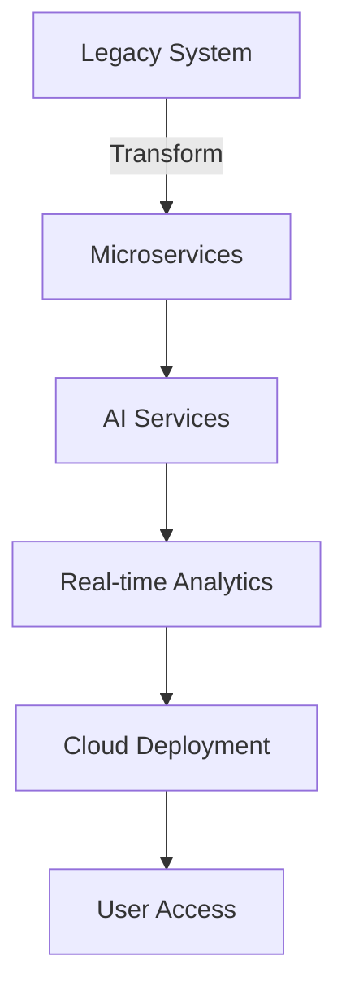

# 🤖 AI-Code-Super-Challenge

Welcome to the **AI-Code-Super-Challenge** repository!

Here you will find two practical programming challenges designed to enhance your skills in Artificial Intelligence, automation, and best coding practices.

---

## 📊 Challenge Comparison

| Challenge | Focus | Main Skills | Technologies | Folder |
|-----------|-------|------------|--------------|--------|
| 🏢 **Enterprise AI Transformation** | Modernize legacy systems, build AI microservices | Modernization, microservices, AI, cloud, security | Python, Azure, CI/CD | `Enterprise-AI-Transformation/` |
| 🏆 **Ultimate Mastery Challenge** | Build a full-stack AI enterprise system | Full-stack, AI, automation, CI/CD, monitoring | Python, Shell, Azure, Copilot | `Ultimate-Matery-Challenge/` |

---

## 🏢 Challenge 1: Super Challenge - Enterprise AI Transformation
Welcome to the ultimate test of your AI-powered development skills! This comprehensive challenge simulates a real-world enterprise transformation project. Your mission is to transform GlobalRetail Corp's legacy systems into a modern, AI-powered platform:

- Modernize legacy COBOL inventory system
- Build microservices architecture with AI capabilities
- Implement real-time analytics and predictions
- Deploy to Azure with full CI/CD
- Ensure security and compliance

- **Suggested language:** Python (and other relevant technologies)
- **Skills covered:** Enterprise modernization, microservices, AI integration, cloud deployment, security
- **Challenge folder:** `Enterprise-AI-Transformation/`

## 🏆 Challenge 2: Ultimate Mastery Challenge
Welcome to the pinnacle of your AI development journey! This comprehensive assessment validates your mastery across AI development. You will build a complete AI-powered enterprise system, integrating multiple technologies into a production-ready solution:

- Full-stack application with AI features
- Microservices architecture
- AI agents with MCP integration
- Security implementation
- CI/CD pipeline
- Monitoring and observability
- Documentation

- **Suggested language:** Python, Shell Script, and other relevant technologies
- **Skills covered:** Full-stack development, AI integration, microservices, automation, CI/CD, security, monitoring
- **Challenge folder:** `Ultimate-Matery-Challenge/`

---

## 🗺️ Architecture Overview

---

## 📝 How to participate
1. Fork this repository.
2. Choose one or both challenges and follow the instructions in their respective folders.
3. Submit your solutions via Pull Request.

---

---

## 🚀 Why Participate?

- Boost your AI and automation skills with real-world challenges
- Build impressive portfolio projects to showcase on LinkedIn or your resume
- Network with a community of passionate developers
- All skill levels welcome—learn as you go!

## 🥇 Recognition & Rewards

- Top solutions may be featured in the repository
- Earn digital certificates of completion
- Climb the leaderboard and gain community recognition

## � What You'll Learn

- Enterprise modernization and cloud deployment
- Full-stack and microservices architecture
- Real-time analytics, automation, and AI integration
- CI/CD, security, and monitoring best practices

## 🤝 Community & Support

- Join our GitHub Discussions for help and networking
- Share your progress on social media with **#AICodeSuperChallenge**

---

---

> **Challenge yourself, grow your skills, and have fun!**

---

---

These challenges were developed by [@paulanunes85](https://github.com/paulanunes85), AI App and Software Developer Black Belt at Microsoft.