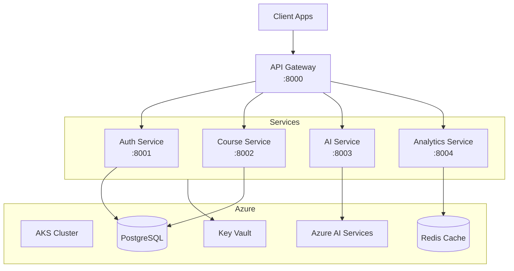

# Ultimate Mastery Challenge - Hour 2: Advanced to Enterprise

## 🚀 Transforming to Enterprise-Grade Solution

Now that you have the foundation, it's time to transform MasteryEd into an enterprise-ready platform with microservices, cloud deployment, security, and monitoring.

## 📋 Hour 2 Requirements (Minutes 60-120)

### Enterprise Architecture Implementation

During this hour, you'll demonstrate mastery of modules 11-20 by adding enterprise features.

### 🔨 Tasks to Complete

#### 1. Microservices Architecture (Minutes 60-75)
Refactor into microservices:

```python
# Copilot Prompt Suggestion:
# Refactor the monolithic application into microservices:
# - Auth Service: Handle all authentication/authorization
# - Course Service: Manage courses and content
# - AI Service: Handle all AI operations
# - Analytics Service: Track usage and progress
# Include service discovery and API gateway
```

**Services to Create:**

1. **Auth Service**
   ```python
   # Port 8001
   # Handles: User registration, login, JWT management
   # Database: Users, roles, permissions
   ```

2. **Course Service**
   ```python
   # Port 8002  
   # Handles: Course CRUD, enrollments, progress
   # Database: Courses, modules, lessons, enrollments
   ```

3. **AI Service**
   ```python
   # Port 8003
   # Handles: Content generation, summarization, quiz creation
   # Integrations: OpenAI, Azure AI Services
   ```

4. **API Gateway**
   ```python
   # Port 8000
   # Routes requests to appropriate services
   # Handles: Rate limiting, authentication check
   ```

#### 2. Security Implementation (Minutes 75-90)
Add enterprise security features:

```yaml
# Copilot Prompt Suggestion:
# Implement comprehensive security:
# - OAuth2/OIDC integration
# - Role-based access control (RBAC)
# - API key management for external access
# - Input validation and sanitization
# - SQL injection prevention
# - XSS protection
# - Rate limiting per user/IP
# - Audit logging for compliance
```

**Security Requirements:**
- JWT with refresh tokens
- RBAC with granular permissions
- API key system for B2B access
- Input validation on all endpoints
- Prepared statements for all queries
- Content Security Policy headers
- CORS properly configured
- Secrets management (not hardcoded!)

**Compliance Features:**
- GDPR data export endpoint
- User data deletion (right to be forgotten)
- Audit trail for all data access
- Consent management system

#### 3. Cloud Deployment - Azure (Minutes 90-105)
Deploy to Azure with IaC:

```bicep
// Copilot Prompt Suggestion:
// Create Bicep templates for:
// - Azure Kubernetes Service (AKS) cluster
// - Azure Database for PostgreSQL
// - Azure Cache for Redis
// - Azure Application Gateway
// - Azure Container Registry
// - Azure Key Vault for secrets
// Include proper networking and security
```

**Azure Resources to Deploy:**
1. **AKS Cluster**
   - 3 node pools (system, services, AI workloads)
   - Autoscaling enabled
   - Azure CNI networking

2. **Databases**
   - PostgreSQL Flexible Server
   - Redis Cache Premium tier
   - Cosmos DB for analytics

3. **Networking**
   - Virtual Network with subnets
   - Network Security Groups
   - Application Gateway with WAF

4. **Supporting Services**
   - Key Vault for secrets
   - Container Registry
   - Log Analytics Workspace

#### 4. Monitoring & Observability (Minutes 105-120)
Implement comprehensive monitoring:

```yaml
# Copilot Prompt Suggestion:
# Set up monitoring stack:
# - Application Insights for each service
# - Distributed tracing with OpenTelemetry
# - Custom metrics for business KPIs
# - Log aggregation with queries
# - Alerts for critical issues
# - Dashboards for operations team
```

**Monitoring Components:**

1. **Application Performance**
   ```python
   # Add to each service
   from opentelemetry import trace
   from azure.monitor.opentelemetry import AzureMonitorTraceExporter
   
   # Track custom metrics
   track_event("course_enrolled", {
       "course_id": course_id,
       "user_id": user_id,
       "price": price
   })
   ```

2. **Business Metrics Dashboard**
   - Active users (DAU/MAU)
   - Course completion rates
   - AI feature usage
   - Revenue metrics
   - System performance

3. **Alerts Configuration**
   - API response time > 500ms
   - Error rate > 1%
   - Database connection failures
   - AI service quota warnings
   - Security anomalies

### 📊 Evaluation Criteria - Hour 2

#### Architecture (15 points)
- Clean microservices separation
- Proper service communication
- Scalability considerations
- Fault tolerance implemented

#### Security (15 points)
- Comprehensive security measures
- No hardcoded secrets
- Proper authentication/authorization
- Compliance features working

#### Cloud Deployment (10 points)
- Infrastructure as Code used
- Resources properly configured
- Networking correctly set up
- Deployment successful

#### Monitoring (10 points)
- Distributed tracing working
- Custom metrics tracked
- Alerts configured
- Dashboards created

### 💡 Tips for Hour 2

1. **Use Templates**: Leverage Copilot for Bicep/Terraform
2. **Security First**: Don't skip security for time
3. **Automate Deployment**: Use GitHub Actions
4. **Test Incrementally**: Verify each service works
5. **Document Architecture**: Create simple diagrams

### 🛠️ Additional Technologies

```yaml
# Kubernetes
kubectl==1.28
helm==3.13

# Monitoring
opentelemetry-api==1.20.0
opentelemetry-instrumentation-fastapi==0.41b0
azure-monitor-opentelemetry==1.1.0

# Security
python-jose[cryptography]==3.3.0
authlib==1.2.1
cryptography==41.0.7
```

### 🚨 Common Pitfalls to Avoid

- ❌ Making services too granular
- ❌ Forgetting service discovery
- ❌ Hardcoding service URLs
- ❌ Skipping security headers
- ❌ Not testing deployment scripts

### ✅ Hour 2 Checklist

Before moving to Hour 3, ensure you have:
- [ ] Microservices running independently
- [ ] API Gateway routing correctly
- [ ] Security measures implemented
- [ ] Deployed to Azure successfully
- [ ] Monitoring data flowing
- [ ] All infrastructure codified
- [ ] Services communicating properly
- [ ] Documentation updated

### 🎯 Stretch Goals (If Time Permits)

- Add circuit breakers between services
- Implement distributed caching
- Add GraphQL endpoint
- Create backup/restore procedures
- Implement blue-green deployment

### 📈 Architecture Diagram



---

## 🏃 Ready for Hour 3?

Once you've completed Hour 2 requirements:
1. Verify all services are running: `kubectl get pods`
2. Test API Gateway routes: `curl http://localhost:8000/health`
3. Check monitoring dashboard
4. Commit changes: `git commit -m "Hour 2 complete: Enterprise features added"`
5. Prepare for the final hour!

**Remember**: Focus on working enterprise features over perfect implementation. The goal is demonstrating you can build production systems!
