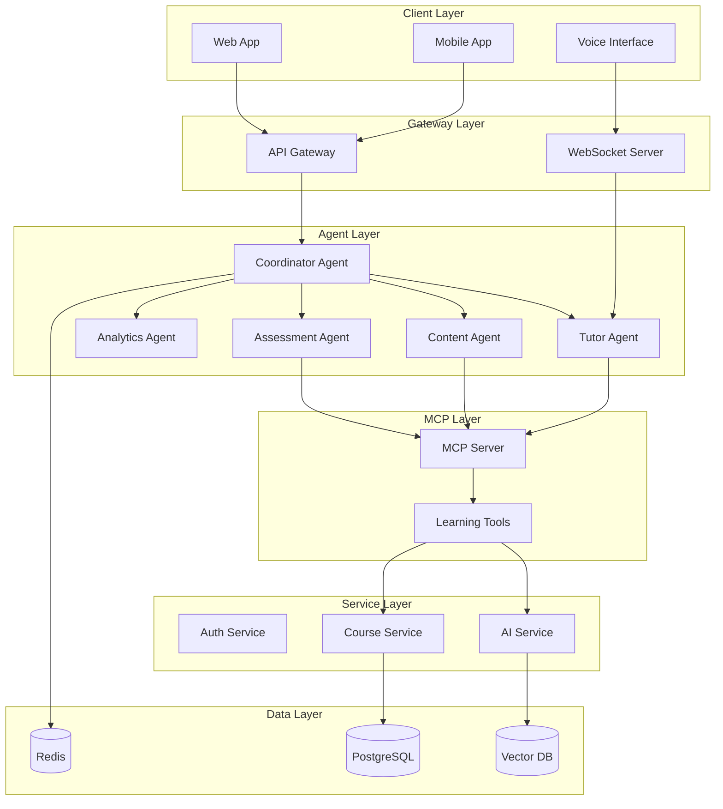

# Ultimate Mastery Challenge - Hour 3: Agents and Integration

## 🤖 Adding Intelligence with AI Agents

In this final hour, you'll add sophisticated AI capabilities to MasteryEd using agents, MCP, and advanced orchestration patterns.

## 📋 Hour 3 Requirements (Minutes 120-180)

### AI Agent Implementation

Demonstrate mastery by creating an intelligent tutoring system.

### 🔨 Tasks to Complete

#### 1. AI Agent Development (Minutes 120-135)
Create specialized AI agents:

```typescript
// Copilot Prompt Suggestion:
// Create AI agents for the e-learning platform:
// - Tutor Agent: Personalized learning assistance
// - Content Agent: Generate course materials
// - Assessment Agent: Create and grade quizzes
// - Analytics Agent: Learning insights
// Use TypeScript with proper interfaces and error handling
```

**Agents to Implement:**

1. **Tutor Agent**
   ```typescript
   interface TutorAgent {
     // Answers student questions
     answerQuestion(context: LearningContext, question: string): Promise<Answer>
     // Provides personalized hints
     provideHint(problem: Problem, attemptHistory: Attempt[]): Promise<Hint>
     // Explains concepts adaptively
     explainConcept(concept: string, studentLevel: Level): Promise<Explanation>
   }
   ```

2. **Content Agent**
   ```typescript
   interface ContentAgent {
     // Generates lesson summaries
     summarizeLesson(content: string): Promise<Summary>
     // Creates practice problems
     generateProblems(topic: string, difficulty: number): Promise<Problem[]>
     // Produces study guides
     createStudyGuide(course: Course): Promise<StudyGuide>
   }
   ```

3. **Assessment Agent**
   ```typescript
   interface AssessmentAgent {
     // Creates quizzes from content
     generateQuiz(lesson: Lesson, questions: number): Promise<Quiz>
     // Grades open-ended responses
     gradeResponse(question: string, answer: string): Promise<Grade>
     // Provides feedback
     generateFeedback(submission: Submission): Promise<Feedback>
   }
   ```

#### 2. MCP Implementation (Minutes 135-150)
Implement Model Context Protocol:

```typescript
// Copilot Prompt Suggestion:
// Implement MCP server and client:
// - MCP Server exposing learning tools
// - Client for agent communication
// - Tools for: database queries, content retrieval, analytics
// - Proper error handling and retries
// Follow the official MCP specification
```

**MCP Components:**

1. **MCP Server Setup**
   ```typescript
   // mcp-server/index.ts
   import { MCPServer } from '@modelcontextprotocol/server'
   
   const server = new MCPServer({
     name: 'mastery-ed-tools',
     version: '1.0.0',
     tools: [
       {
         name: 'get_student_progress',
         description: 'Retrieve student progress for a course',
         parameters: {
           student_id: { type: 'string', required: true },
           course_id: { type: 'string', required: true }
         }
       },
       {
         name: 'search_knowledge_base',
         description: 'Search course content and materials',
         parameters: {
           query: { type: 'string', required: true },
           course_id: { type: 'string', optional: true }
         }
       },
       // Add more tools...
     ]
   })
   ```

2. **Tool Implementations**
   ```typescript
   // Student progress tool
   async function getStudentProgress(params: any) {
     const { student_id, course_id } = params
     // Query database for progress
     // Calculate completion percentage
     // Identify struggling areas
     return {
       completion: 75,
       struggling_topics: ['recursion', 'async'],
       recommended_next: 'practice_problems_recursion'
     }
   }
   ```

3. **MCP Client Integration**
   ```typescript
   // Integrate MCP client into agents
   class EnhancedTutorAgent implements TutorAgent {
     constructor(private mcpClient: MCPClient) {}
     
     async answerQuestion(context: LearningContext, question: string) {
       // Use MCP tools to get context
       const progress = await this.mcpClient.call('get_student_progress', {
         student_id: context.student_id,
         course_id: context.course_id
       })
       
       // Generate personalized answer
       return this.generateAnswer(question, progress)
     }
   }
   ```

#### 3. Multi-Agent Orchestration (Minutes 150-165)
Create agent orchestration system:

```python
# Copilot Prompt Suggestion:
# Build multi-agent orchestration system:
# - Coordinator agent that manages others
# - Message passing between agents
# - Workflow for complex tasks
# - State management across agents
# - Error recovery and fallbacks
```

**Orchestration Patterns:**

1. **Coordinator Agent**
   ```python
   class LearningCoordinator:
       def __init__(self):
           self.tutor = TutorAgent()
           self.content = ContentAgent()
           self.assessment = AssessmentAgent()
           self.analytics = AnalyticsAgent()
       
       async def handle_learning_session(self, student_id: str, request: LearningRequest):
           # Analyze student state
           analysis = await self.analytics.analyze_student(student_id)
           
           # Route to appropriate agent
           if request.type == "question":
               return await self.tutor.answer(request, analysis)
           elif request.type == "practice":
               problems = await self.content.generate_problems(analysis)
               return await self.assessment.create_practice(problems)
   ```

2. **Complex Workflow Example**
   ```python
   async def adaptive_learning_path(student_id: str, topic: str):
       # Step 1: Assess current knowledge
       pre_test = await assessment_agent.create_diagnostic(topic)
       results = await assessment_agent.grade(pre_test)
       
       # Step 2: Generate personalized content
       content = await content_agent.create_adaptive_lesson(topic, results)
       
       # Step 3: Monitor learning
       async with learning_session(student_id) as session:
           await tutor_agent.guide_learning(session, content)
           
       # Step 4: Final assessment
       post_test = await assessment_agent.create_assessment(topic)
       return await analytics_agent.measure_improvement(pre_test, post_test)
   ```

#### 4. Final Integration & Validation (Minutes 165-180)
Integrate everything and validate:

```yaml
# Copilot Prompt Suggestion:
# Final integration tasks:
# - Connect agents to microservices
# - Add agent monitoring
# - Implement conversation history
# - Create demo scenarios
# - Performance optimization
# - Final security review
# - Complete documentation
```

**Integration Tasks:**

1. **Service Integration**
   - Connect agents to API Gateway
   - Add agent endpoints to services
   - Implement WebSocket for real-time agent chat
   - Store conversation history

2. **Monitoring & Analytics**
   ```python
   # Track agent performance
   metrics.track("agent_response_time", {
       "agent": "tutor",
       "operation": "answer_question",
       "duration_ms": response_time
   })
   
   # Monitor token usage
   metrics.track("ai_tokens_used", {
       "agent": agent_name,
       "tokens": token_count,
       "cost": estimated_cost
   })
   ```

3. **Demo Scenarios**
   - Student asking for help with concept
   - Auto-generating quiz from lesson
   - Adaptive learning path creation
   - Multi-agent collaboration example

### 📊 Evaluation Criteria - Hour 3

#### Agent Implementation (15 points)
- Agents properly designed
- Clear separation of concerns
- Error handling implemented
- Appropriate AI model usage

#### MCP Integration (10 points)
- MCP server functional
- Tools properly exposed
- Client integration working
- Protocol compliance

#### Orchestration (10 points)
- Multi-agent coordination
- Complex workflows handled
- State management proper
- Scalability considered

#### Final Integration (15 points)
- Everything working together
- Performance acceptable
- Security maintained
- Documentation complete

### 💡 Tips for Hour 3

1. **Start with One Agent**: Get one working before adding others
2. **Use TypeScript**: Better for agent interfaces
3. **Test MCP Locally**: Ensure tools work before integration
4. **Simple Orchestration First**: Add complexity gradually
5. **Document Agent Capabilities**: Clear API documentation

### 🛠️ Additional Technologies

```json
{
  "dependencies": {
    "@modelcontextprotocol/server": "^1.0.0",
    "@modelcontextprotocol/client": "^1.0.0",
    "openai": "^4.0.0",
    "@azure/ai-text-analytics": "^5.1.0",
    "langchain": "^0.0.200",
    "bull": "^4.11.0",
    "ioredis": "^5.3.0"
  }
}
```

### 🚨 Common Pitfalls to Avoid

- ❌ Over-complicating agent interactions
- ❌ Not handling rate limits
- ❌ Forgetting conversation context
- ❌ Missing error recovery
- ❌ Ignoring token costs

### ✅ Hour 3 Final Checklist

Complete system validation:
- [ ] All agents responding correctly
- [ ] MCP server accessible
- [ ] Multi-agent workflows functional
- [ ] Integration with services complete
- [ ] Monitoring showing agent metrics
- [ ] Demo scenarios working
- [ ] Documentation comprehensive
- [ ] All code committed

### 🎯 Stretch Goals (If Time Permits)

- Add voice interface to tutor agent
- Implement agent memory/learning
- Create agent marketplace concept
- Add A/B testing for agents
- Build agent analytics dashboard

### 🏗️ Final Architecture



---

### 🏆 You Did It!

Congratulations on completing the Ultimate Mastery Challenge! You've demonstrated:
- ✅ AI-assisted development mastery
- ✅ Enterprise architecture skills
- ✅ Cloud deployment expertise
- ✅ AI agent development
- ✅ Production-ready mindset

**Welcome to the elite group of AI Development Masters!** 🌟
