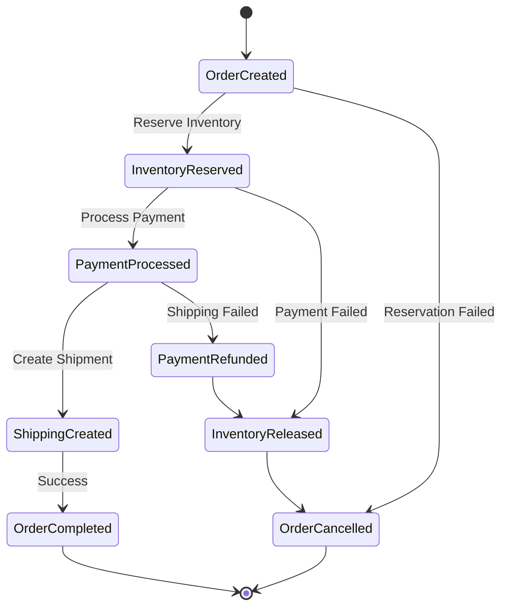

# Exercise 2: Event-Driven Microservices ⭐⭐

## 🎯 Overview

In this exercise, you'll build a distributed e-commerce system using event-driven microservices architecture. You'll implement event sourcing, CQRS, saga orchestration, and handle complex distributed transactions across multiple services. This real-world scenario demonstrates how enterprise systems handle millions of transactions with resilience and scalability.

### Duration: 45-60 minutes

### Difficulty: ⭐⭐ Medium (Real-world Scenario)

## 🏗️ System Architecture

```mermaid
graph TB
    subgraph "API Gateway"
        GATEWAY[YARP Gateway]
        AUTH[Auth Service]
    end
    
    subgraph "Order Service"
        ORDER_API[Order API]
        ORDER_DB[(Order DB)]
        ORDER_SAGA[Order Saga]
        ORDER_EVENTS[(Event Store)]
    end
    
    subgraph "Inventory Service"
        INV_API[Inventory API]
        INV_DB[(Inventory DB)]
        INV_PROJ[Projections]
    end
    
    subgraph "Payment Service"
        PAY_API[Payment API]
        PAY_DB[(Payment DB)]
        PAY_GATEWAY[Payment Gateway]
    end
    
    subgraph "Shipping Service"
        SHIP_API[Shipping API]
        SHIP_DB[(Shipping DB)]
        SHIP_PROV[Providers]
    end
    
    subgraph "Notification Service"
        NOTIF_API[Notification API]
        EMAIL[Email Service]
        SMS[SMS Service]
        PUSH[Push Service]
    end
    
    subgraph "Event Infrastructure"
        SERVICE_BUS[Azure Service Bus]
        EVENT_GRID[Event Grid]
        COSMOS_CHANGE[(Cosmos DB Change Feed)]
    end
    
    subgraph "Monitoring"
        APP_INSIGHTS[Application Insights]
        LOG_ANALYTICS[Log Analytics]
        GRAFANA[Grafana]
    end
    
    GATEWAY --> ORDER_API
    GATEWAY --> INV_API
    GATEWAY --> PAY_API
    GATEWAY --> SHIP_API
    
    ORDER_API --> ORDER_SAGA
    ORDER_SAGA --> SERVICE_BUS
    
    SERVICE_BUS --> INV_API
    SERVICE_BUS --> PAY_API
    SERVICE_BUS --> SHIP_API
    SERVICE_BUS --> NOTIF_API
    
    ORDER_EVENTS --> COSMOS_CHANGE
    COSMOS_CHANGE --> EVENT_GRID
    
    All Services -.-> APP_INSIGHTS
    All Services -.-> LOG_ANALYTICS
    
    style ORDER_SAGA fill:#F59E0B
    style SERVICE_BUS fill:#10B981
    style COSMOS_CHANGE fill:#512BD4
```

## 📋 Learning Objectives

By completing this exercise, you will:

1. **Design Microservices** - Create bounded contexts and service boundaries
2. **Implement Event Sourcing** - Store domain events as source of truth
3. **Apply CQRS Pattern** - Separate commands from queries
4. **Build Saga Orchestration** - Manage distributed transactions
5. **Handle Failures** - Implement compensating transactions
6. **Ensure Consistency** - Achieve eventual consistency across services

## 🔧 Technical Stack

- **.NET 8** - Microservices implementation
- **MassTransit** - Service bus abstraction and saga orchestration
- **Azure Service Bus** - Message broker
- **Cosmos DB** - Event store with change feed
- **SQL Server** - Service databases
- **Redis** - Distributed cache and pub/sub
- **Docker & Kubernetes** - Container orchestration
- **Polly** - Resilience and transient fault handling

## 📦 What You'll Build

A complete e-commerce order processing system with:

### 1. Order Service
- Order creation and management
- Order saga orchestration
- Event sourcing for order history
- CQRS with separate read models

### 2. Inventory Service
- Real-time inventory tracking
- Reservation and release logic
- Stock level projections
- Low stock notifications

### 3. Payment Service
- Payment processing integration
- Payment method validation
- Refund handling
- PCI compliance patterns

### 4. Shipping Service
- Shipping provider integration
- Label generation
- Tracking updates
- Delivery confirmation

### 5. Notification Service
- Multi-channel notifications
- Template management
- Delivery tracking
- User preferences

### 6. Cross-Cutting Concerns
- Distributed tracing
- Centralized logging
- Health monitoring
- Circuit breakers

## 🚀 Scenario: Order Processing Workflow

The system handles a complete order lifecycle:

1. **Customer places order** → Order Service creates order aggregate
2. **Inventory check** → Inventory Service reserves items
3. **Payment processing** → Payment Service charges customer
4. **Shipping creation** → Shipping Service generates label
5. **Notifications** → Customer receives confirmations
6. **Failure handling** → Compensating transactions on any failure

## 🎭 Saga Orchestration Flow



## 📂 Exercise Structure

```
exercise2-event-driven/
├── README.md                    # This file
├── instructions/
│   ├── part1-architecture.md   # Service design and setup
│   ├── part2-implementation.md # Core services implementation
│   └── part3-integration.md    # Saga and integration
├── starter/
│   ├── Microservices.sln       # Solution file
│   ├── src/
│   │   ├── Services/           # Individual microservices
│   │   ├── Shared/             # Shared contracts and utilities
│   │   └── Infrastructure/     # Cross-cutting infrastructure
│   ├── docker-compose.yml      # Local development setup
│   └── k8s/                    # Kubernetes manifests
├── solution/
│   └── [Complete implementation]
├── tests/
│   ├── unit/                   # Service unit tests
│   ├── integration/            # Cross-service tests
│   └── chaos/                  # Chaos engineering tests
└── scripts/
    ├── setup-local.ps1         # Local environment setup
    └── run-chaos-tests.ps1     # Chaos testing scripts
```

## 🎯 Success Criteria

Your implementation should:

- ✅ Handle 10,000+ orders per minute
- ✅ Maintain data consistency across services
- ✅ Recover from service failures gracefully
- ✅ Complete 99% of orders within 5 seconds
- ✅ Provide real-time order status updates
- ✅ Scale individual services independently
- ✅ Maintain audit trail for all operations
- ✅ Pass chaos engineering tests

## 💡 Implementation Strategy

### Service Design Principles
- One database per service
- Async communication via events
- No direct service-to-service calls
- Idempotent operations
- Event sourcing for critical data

### Resilience Patterns
- Circuit breakers for external calls
- Retry with exponential backoff
- Timeout policies
- Bulkhead isolation
- Fallback strategies

### Data Consistency
- Eventual consistency between services
- Saga pattern for distributed transactions
- Compensating transactions
- Idempotency keys
- Event deduplication

### Monitoring Strategy
- Distributed tracing with correlation IDs
- Structured logging
- Custom metrics and alerts
- Health checks per service
- Performance dashboards

## 🧪 Testing Approach

### Unit Tests
- Domain logic testing
- Event handler testing
- Saga state machine testing

### Integration Tests
- Service interaction testing
- Message flow validation
- Database integration

### Chaos Engineering
- Service failure simulation
- Network partition testing
- Resource exhaustion
- Message loss scenarios

## 📚 Key Concepts

### Event Sourcing
- Events as source of truth
- Event store implementation
- Snapshot optimization
- Event replay capability

### CQRS Implementation
- Command handlers
- Query handlers
- Read model projections
- Eventually consistent views

### Saga Pattern
- Orchestration vs Choreography
- State persistence
- Timeout handling
- Compensation logic

### Service Communication
- Asynchronous messaging
- Event-driven architecture
- Publish-subscribe pattern
- Request-response over messaging

## 🔧 Prerequisites

Before starting, ensure you have:
- Docker Desktop running
- Azure Service Bus namespace (or emulator)
- Redis running locally
- SQL Server instances
- k6 for load testing

## 🎉 What You'll Achieve

Upon completion, you'll have:
- Production-ready microservices architecture
- Deep understanding of distributed systems
- Event-driven communication patterns
- Saga orchestration expertise
- Chaos engineering experience

## ⏭️ Next Steps

After completing this exercise:
1. Review the solution implementation
2. Experiment with different failure scenarios
3. Try implementing additional services (e.g., Returns)
4. Move on to Exercise 3: AI-Powered Enterprise System

## 💡 Pro Tips

1. **Start Small**: Implement basic flow first, then add complexity
2. **Test Early**: Write tests for message contracts first
3. **Monitor Everything**: Add logging and metrics from the start
4. **Think Async**: Design for eventual consistency
5. **Handle Failures**: Every operation should have a compensation

---

**🏆 Challenge**: This exercise simulates real-world distributed systems used by major e-commerce platforms. The patterns you implement here handle billions of dollars in transactions!