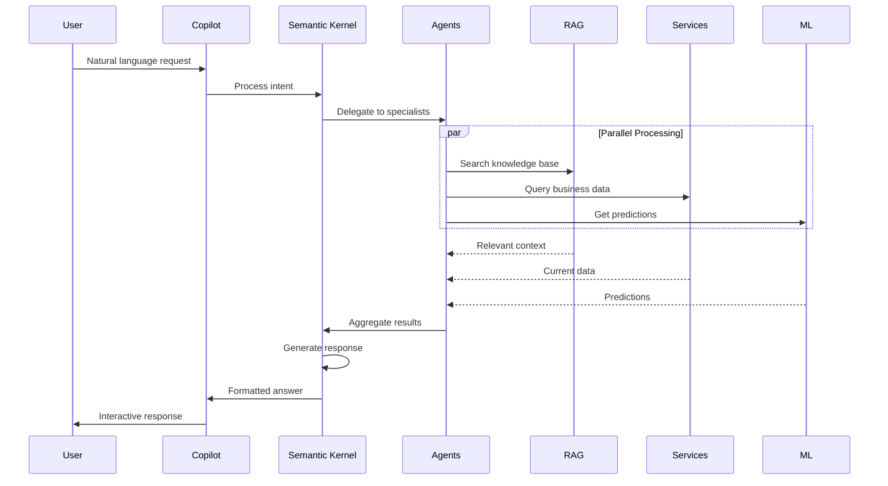

# Exercise 3: AI-Powered Enterprise System ⭐⭐⭐

## 🎯 Overview

In this culminating exercise, you'll build a complete enterprise solution that combines all the patterns, AI capabilities, and production features learned throughout the workshop. This system represents the pinnacle of modern enterprise development, integrating advanced AI features with robust enterprise architecture.

### Duration: 60-90 minutes

### Difficulty: ⭐⭐⭐ Hard (Production Challenge)

## 🏗️ System Architecture

```mermaid
graph TB
    subgraph "Intelligent Interface Layer"
        COPILOT[AI Copilot Interface]
        NLU[Natural Language Understanding]
        VOICE[Voice Interface]
        CHAT[Conversational UI]
    end
    
    subgraph "AI Orchestration Layer"
        SK[Semantic Kernel]
        AGENTS[Multi-Agent System]
        RAG[RAG Pipeline]
        FLOW[Workflow Engine]
    end
    
    subgraph "Business Intelligence"
        ANALYTICS[Predictive Analytics]
        INSIGHTS[Business Insights]
        ANOMALY[Anomaly Detection]
        FORECAST[Demand Forecasting]
    end
    
    subgraph "Core Services"
        CRM[Customer 360°]
        INVENTORY[Smart Inventory]
        PRICING[Dynamic Pricing]
        RECOMMENDATION[Recommendation Engine]
    end
    
    subgraph "Data Platform"
        LAKE[Data Lake]
        VECTOR_DB[Vector Database]
        GRAPH_DB[Graph Database]
        STREAM[Event Streaming]
    end
    
    subgraph "Infrastructure"
        AKS[Azure Kubernetes]
        APIM[API Management]
        SENTINEL[Security Center]
        MONITOR[Azure Monitor]
    end
    
    Intelligent Interface Layer --> AI Orchestration Layer
    AI Orchestration Layer --> Business Intelligence
    AI Orchestration Layer --> Core Services
    Business Intelligence --> Data Platform
    Core Services --> Data Platform
    Data Platform --> Infrastructure
    
    style SK fill:#10B981
    style AGENTS fill:#F59E0B
    style RAG fill:#8B5CF6
    style VECTOR_DB fill:#512BD4
```

## 📋 Learning Objectives

By completing this exercise, you will:

1. **Build AI-First Architecture** - Design systems with AI at the core
2. **Implement Multi-Agent Systems** - Orchestrate specialized AI agents
3. **Create RAG Solutions** - Build retrieval-augmented generation pipelines
4. **Apply ML Operations** - Deploy and monitor AI models in production
5. **Ensure Enterprise Scale** - Handle millions of users and requests
6. **Master Integration** - Connect all components seamlessly

## 🔧 Technology Stack

### AI/ML Technologies
- **Semantic Kernel** - AI orchestration framework
- **Azure OpenAI** - GPT-4 and embeddings
- **Azure AI Search** - Hybrid search with vectors
- **ML.NET** - Custom model training
- **Azure AI Document Intelligence** - Document processing
- **Azure Cognitive Services** - Vision, speech, language

### Data Technologies
- **Cosmos DB** - Multi-model database with vector search
- **Azure Data Lake** - Big data storage
- **Azure Synapse** - Analytics workspace
- **Event Hubs** - Real-time data ingestion
- **Azure Cache for Redis** - High-performance caching

### Enterprise Technologies
- **.NET 8** - Core application framework
- **Azure Kubernetes Service** - Container orchestration
- **Azure API Management** - API gateway and management
- **Microsoft Entra ID** - Identity and access
- **Azure Key Vault** - Secrets management
- **Application Insights** - APM and diagnostics

## 📦 What You'll Build

A comprehensive AI-powered enterprise platform featuring:

### 1. Intelligent Customer Service
- Natural language query understanding
- Multi-turn conversational interface
- Context-aware responses
- Sentiment analysis and routing
- Automated issue resolution

### 2. Predictive Business Operations
- Demand forecasting with ML
- Inventory optimization
- Dynamic pricing engine
- Anomaly detection
- Churn prediction

### 3. Knowledge Management System
- Document ingestion and processing
- Semantic search across all data
- Automatic summarization
- Knowledge graph construction
- Expert finder

### 4. Personalization Engine
- Real-time recommendations
- Behavioral analysis
- A/B testing framework
- Customer segmentation
- Journey optimization

### 5. Operational Intelligence
- Real-time dashboards
- Predictive maintenance
- Process mining
- Automated reporting
- Alert correlation

## 🎯 Scenario: Enterprise AI Transformation

Your company needs a next-generation platform that:

1. **Understands** natural language requests from users
2. **Analyzes** vast amounts of business data
3. **Predicts** future trends and issues
4. **Automates** complex decision-making
5. **Learns** continuously from interactions
6. **Scales** to millions of users globally

## 🤖 AI Architecture Deep Dive



## 📂 Exercise Structure

```
exercise3-ai-enterprise/
├── README.md                       # This file
├── instructions/
│   ├── part1-ai-foundation.md    # AI infrastructure setup
│   ├── part2-implementation.md    # Core system implementation
│   └── part3-production.md        # Production deployment
├── starter/
│   ├── AIEnterprise.sln          # Solution file
│   ├── src/
│   │   ├── Core/                 # Domain and application
│   │   ├── AI/                   # AI services and agents
│   │   ├── Infrastructure/       # Data and external services
│   │   ├── API/                  # API layer
│   │   └── WebApp/               # Blazor UI
│   ├── notebooks/                # Jupyter notebooks for ML
│   └── infrastructure/           # IaC templates
├── solution/
│   └── [Complete implementation]
├── tests/
│   ├── unit/                     # Unit tests
│   ├── integration/              # Integration tests
│   ├── ai/                       # AI-specific tests
│   └── load/                     # Performance tests
└── docs/
    ├── architecture/             # Architecture documentation
    ├── ai-models/                # Model documentation
    └── deployment/               # Deployment guides
```

## 🎯 Success Criteria

Your implementation should:

- ✅ Process 100,000+ AI requests per minute
- ✅ Achieve <200ms response time for queries
- ✅ Maintain 99.9% uptime
- ✅ Handle multi-modal inputs (text, voice, images)
- ✅ Provide accurate predictions (>90% accuracy)
- ✅ Scale elastically based on demand
- ✅ Ensure data privacy and compliance
- ✅ Support continuous learning and improvement

## 💡 Implementation Strategy

### Phase 1: AI Foundation
- Set up Semantic Kernel orchestration
- Configure vector databases
- Implement RAG pipeline
- Create base AI agents

### Phase 2: Business Logic
- Build domain services
- Integrate with existing systems
- Implement caching strategies
- Add monitoring and logging

### Phase 3: Intelligence Layer
- Train custom ML models
- Deploy to production
- Set up A/B testing
- Implement feedback loops

### Phase 4: User Experience
- Create conversational interface
- Build real-time dashboards
- Add voice capabilities
- Implement personalization

## 🧪 Testing Approach

### AI Testing
- Prompt injection tests
- Hallucination detection
- Response quality metrics
- Performance benchmarks

### Integration Testing
- End-to-end scenarios
- Multi-agent coordination
- Data consistency
- Error handling

### Load Testing
- Concurrent user simulation
- AI service stress tests
- Database performance
- Cache effectiveness

## 📚 Key Concepts

### Semantic Kernel
- Plugin architecture
- Memory management
- Function calling
- Context variables

### RAG Implementation
- Document chunking
- Embedding generation
- Hybrid search
- Context assembly

### Multi-Agent Systems
- Agent specialization
- Communication protocols
- Task delegation
- Result aggregation

### MLOps
- Model versioning
- A/B testing
- Drift detection
- Continuous training

## 🔧 Prerequisites

Before starting, ensure you have:
- Completed previous exercises
- Azure OpenAI access
- Azure subscription with credits
- Docker Desktop running
- Visual Studio 2022 or VS Code

## 🎉 What You'll Achieve

Upon completion, you'll have:
- Production-ready AI enterprise system
- Deep understanding of AI architecture
- Experience with cutting-edge technologies
- Portfolio-worthy project
- Skills for AI transformation projects

## ⏭️ Next Steps

After completing this exercise:
1. Deploy to production environment
2. Implement additional AI features
3. Contribute improvements back
4. Build your own AI products

## 💡 Pro Tips

1. **Start Simple**: Get basic AI working first
2. **Test Everything**: AI behavior can be unpredictable
3. **Monitor Costs**: AI services can be expensive
4. **Cache Aggressively**: Reduce API calls
5. **Plan for Failure**: AI services may timeout

---

**🏆 Ultimate Challenge**: This exercise represents the cutting edge of enterprise AI development. The system you build here showcases mastery of both AI technologies and enterprise architecture, preparing you to lead AI transformation initiatives!