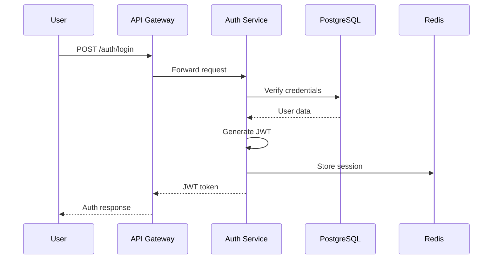
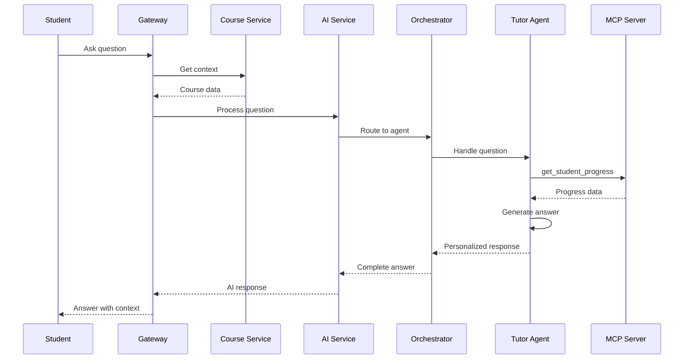
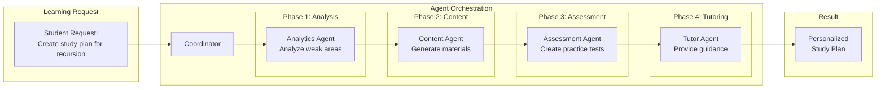
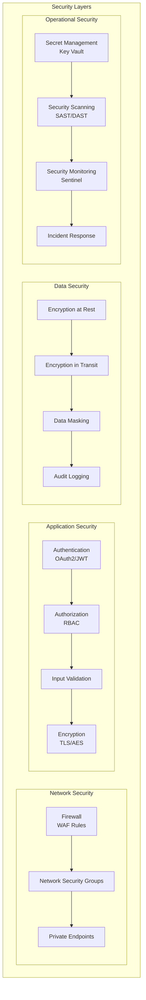

# MasteryEd Platform - System Architecture

## 🏗️ Complete System Architecture

```mermaid
graph TB
    %% Client Layer
    subgraph "Client Applications"
        WEB[Web App<br/>React/Next.js]
        MOBILE[Mobile App<br/>React Native]
        CLI[CLI Tool<br/>Python]
    end

    %% API Gateway Layer
    subgraph "API Gateway"
        GW[API Gateway<br/>:8000]
        WS[WebSocket Server<br/>Real-time Updates]
        LB[Load Balancer<br/>nginx]
    end

    %% Authentication Layer
    subgraph "Authentication"
        AUTH[Auth Service<br/>:8001]
        JWT[JWT Handler]
        RBAC[RBAC Engine]
    end

    %% Core Services
    subgraph "Core Microservices"
        COURSE[Course Service<br/>:8002]
        ENROLL[Enrollment Manager]
        PROGRESS[Progress Tracker]
    end

    %% AI Services
    subgraph "AI & Intelligence"
        AI_SVC[AI Service<br/>:8003]
        
        subgraph "AI Agents"
            TUTOR[Tutor Agent]
            CONTENT[Content Agent]
            ASSESS[Assessment Agent]
            ANALYTICS[Analytics Agent]
        end
        
        ORCHESTRATOR[Agent Orchestrator]
    end

    %% MCP Layer
    subgraph "Model Context Protocol"
        MCP_SERVER[MCP Server<br/>:8005]
        
        subgraph "MCP Tools"
            TOOL1[get_student_progress]
            TOOL2[search_knowledge]
            TOOL3[generate_content]
            TOOL4[evaluate_answer]
        end
    end

    %% Data Layer
    subgraph "Data Storage"
        subgraph "Primary Database"
            PG[(PostgreSQL<br/>Users, Courses, Progress)]
        end
        
        subgraph "Cache Layer"
            REDIS[(Redis<br/>Sessions, Cache)]
        end
        
        subgraph "Vector Store"
            VECTOR[(Vector DB<br/>Embeddings, Search)]
        end
        
        subgraph "Object Storage"
            BLOB[Blob Storage<br/>Media Files]
        end
    end

    %% External Services
    subgraph "External APIs"
        OPENAI[OpenAI API]
        AZURE_AI[Azure AI Services]
        SMTP[Email Service]
        PAYMENT[Payment Gateway]
    end

    %% Monitoring
    subgraph "Observability"
        METRICS[Prometheus<br/>Metrics]
        LOGS[Loki<br/>Logs]
        TRACES[Jaeger<br/>Traces]
        DASH[Grafana<br/>Dashboards]
    end

    %% Infrastructure
    subgraph "Azure Infrastructure"
        subgraph "Compute"
            AKS[AKS Cluster]
            NODES[Node Pools]
        end
        
        subgraph "Networking"
            VNET[Virtual Network]
            NSG[Security Groups]
            AGW[Application Gateway]
        end
        
        subgraph "Security"
            KV[Key Vault]
            IDENTITY[Managed Identity]
        end
    end

    %% Connections - Client to Gateway
    WEB --> LB
    MOBILE --> LB
    CLI --> GW
    LB --> GW
    LB --> WS

    %% Gateway to Services
    GW --> AUTH
    GW --> COURSE
    GW --> AI_SVC
    
    %% Auth Flow
    AUTH --> JWT
    AUTH --> RBAC
    AUTH --> PG
    AUTH --> REDIS

    %% Course Service Flow
    COURSE --> ENROLL
    COURSE --> PROGRESS
    COURSE --> PG
    PROGRESS --> REDIS

    %% AI Service Flow
    AI_SVC --> ORCHESTRATOR
    ORCHESTRATOR --> TUTOR
    ORCHESTRATOR --> CONTENT
    ORCHESTRATOR --> ASSESS
    ORCHESTRATOR --> ANALYTICS

    %% MCP Integration
    TUTOR --> MCP_SERVER
    CONTENT --> MCP_SERVER
    ASSESS --> MCP_SERVER
    MCP_SERVER --> TOOL1
    MCP_SERVER --> TOOL2
    MCP_SERVER --> TOOL3
    MCP_SERVER --> TOOL4

    %% Tool Data Access
    TOOL1 --> PG
    TOOL2 --> VECTOR
    TOOL3 --> OPENAI
    TOOL4 --> AZURE_AI

    %% External Service Connections
    AI_SVC --> OPENAI
    AI_SVC --> AZURE_AI
    AUTH --> SMTP
    COURSE --> PAYMENT

    %% Data Flow
    COURSE --> BLOB
    AI_SVC --> VECTOR
    
    %% Monitoring
    GW -.-> METRICS
    AUTH -.-> METRICS
    COURSE -.-> METRICS
    AI_SVC -.-> METRICS
    
    METRICS --> DASH
    LOGS --> DASH
    TRACES --> DASH

    %% Infrastructure
    AKS --> NODES
    NODES --> GW
    NODES --> AUTH
    NODES --> COURSE
    NODES --> AI_SVC
    
    VNET --> AKS
    NSG --> VNET
    AGW --> LB
    
    KV --> AUTH
    KV --> AI_SVC
    IDENTITY --> KV

    %% Styling
    classDef client fill:#e1f5fe,stroke:#01579b,stroke-width:2px
    classDef gateway fill:#f3e5f5,stroke:#4a148c,stroke-width:2px
    classDef service fill:#e8f5e9,stroke:#1b5e20,stroke-width:2px
    classDef ai fill:#fff3e0,stroke:#e65100,stroke-width:2px
    classDef data fill:#fce4ec,stroke:#880e4f,stroke-width:2px
    classDef external fill:#f3e5f5,stroke:#4a148c,stroke-width:2px
    classDef monitor fill:#e0f2f1,stroke:#004d40,stroke-width:2px
    classDef infra fill:#e8eaf6,stroke:#283593,stroke-width:2px

    class WEB,MOBILE,CLI client
    class GW,WS,LB gateway
    class AUTH,COURSE,JWT,RBAC,ENROLL,PROGRESS service
    class AI_SVC,TUTOR,CONTENT,ASSESS,ANALYTICS,ORCHESTRATOR,MCP_SERVER ai
    class PG,REDIS,VECTOR,BLOB data
    class OPENAI,AZURE_AI,SMTP,PAYMENT external
    class METRICS,LOGS,TRACES,DASH monitor
    class AKS,NODES,VNET,NSG,AGW,KV,IDENTITY infra
```

## 📊 Data Flow Patterns

### 1. User Authentication Flow

### 2. AI-Powered Learning Flow

### 3. Multi-Agent Collaboration

## 🔐 Security Architecture

## 📈 Scaling Strategy

### Horizontal Scaling Points
- **API Gateway**: Load balanced across multiple instances
- **Microservices**: Auto-scaling based on CPU/memory
- **AI Agents**: Queue-based scaling with worker pools
- **Database**: Read replicas for query distribution

### Caching Strategy
1. **L1 Cache**: In-memory (service level)
2. **L2 Cache**: Redis (distributed)
3. **L3 Cache**: CDN (static assets)
4. **L4 Cache**: Database query cache

### Performance Targets
- API Response: < 200ms (p95)
- AI Response: < 2s (p95)
- Page Load: < 3s
- Availability: 99.9%

## 🎯 Key Design Decisions

1. **Microservices Architecture**
   - Independent scaling
   - Technology flexibility
   - Fault isolation

2. **Event-Driven Communication**
   - Loose coupling
   - Async processing
   - Better resilience

3. **AI Agent Abstraction**
   - Modular agents
   - Easy to extend
   - MCP for tools

4. **Multi-Model AI Strategy**
   - OpenAI for complex tasks
   - Azure AI for specific features
   - Local models for privacy

5. **Observability First**
   - Distributed tracing
   - Structured logging
   - Real-time metrics

This architecture provides a solid foundation for the MasteryEd platform, ensuring scalability, security, and maintainability while leveraging cutting-edge AI capabilities.