# Module 30: Visual Mapping - Complete Challenge Coverage 🗺️

## 🎯 3-Hour Challenge Timeline & Module Validation


## 📊 Module Coverage by Challenge Hour

### Hour 1: Building the Foundation (Modules 1-10)


### Hour 2: Enterprise Transformation (Modules 11-20)


### Hour 3: AI Mastery (Modules 21-29)


## 🔄 Cross-Module Integration Points


## 📈 Skill Validation Progression

```mermaid
graph LR
    subgraph "Skill Building"
        A[Basic Copilot Usage] --> B[Complex Development]
        B --> C[Enterprise Architecture]
        C --> D[AI Agent Mastery]
    end
    
    subgraph "Challenge Validation"
        A --> E[Hour 1: Foundation App]
        B --> E
        B --> F[Hour 2: Microservices]
        C --> F
        C --> G[Hour 3: AI Integration]
        D --> G
    end
    
    E --> H{Complete System}
    F --> H
    G --> H
    
    H --> I[🏆 Certified Master]
```



## 🎯 Module-to-Challenge Mapping Table

| Time | Challenge Task | Modules Validated | Key Skills Tested |
|------|---------------|-------------------|-------------------|
| 0:00-0:15 | Project Setup | 1, 2, 6 | AI setup, Copilot basics |
| 0:15-0:30 | Data Models | 3, 4, 5, 9 | Prompting, database design |
| 0:30-0:45 | API Creation | 7, 8 | Web development, APIs |
| 0:45-1:00 | Real-time | 10 | WebSocket, events |
| 1:00-1:15 | Microservices | 11, 12 | Architecture, containers |
| 1:15-1:30 | Security | 13, 14 | Auth, testing |
| 1:30-1:45 | Cloud Deploy | 15, 16, 17 | Cloud-native, DevOps |
| 1:45-2:00 | Monitoring | 18, 19, 20 | AI integration, production |
| 2:00-2:15 | Basic Agents | 21, 22 | Agent creation |
| 2:15-2:30 | MCP Setup | 23 | Protocol implementation |
| 2:30-2:45 | Orchestration | 24, 25 | Multi-agent systems |
| 2:45-3:00 | Integration | 26, 27, 28, 29 | Complete mastery |

## 🏆 Success Criteria by Module Group

### Fundamentals (1-5) ✅
- Clean code with AI assistance
- Proper documentation
- Effective prompting
- Working tests

### Intermediate (6-10) ✅
- Complete web application
- RESTful APIs
- Database integration
- Real-time features

### Advanced (11-15) ✅
- Microservices architecture
- Cloud deployment
- Security implementation
- Performance optimization

### Enterprise (16-20) ✅
- Production patterns
- DevSecOps pipeline
- AI model integration
- Full monitoring

### AI Agents (21-25) ✅
- Working agents
- MCP server
- Multi-agent orchestration
- Advanced patterns

### Mastery (26-30) ✅
- Optional .NET usage
- Security agents
- Complete integration
- Production system

## 💡 Key Insight

The Module 30 challenge is carefully crafted to ensure that **every single skill** from all 29 modules is not just tested, but **applied in a real-world context**. This creates a comprehensive validation that proves true mastery of AI-powered development.

### The Magic Formula:
```
Foundation Skills (1-10) + Enterprise Capabilities (11-20) + AI Agent Mastery (21-29) 
= Complete AI Development Expert 🌟
```